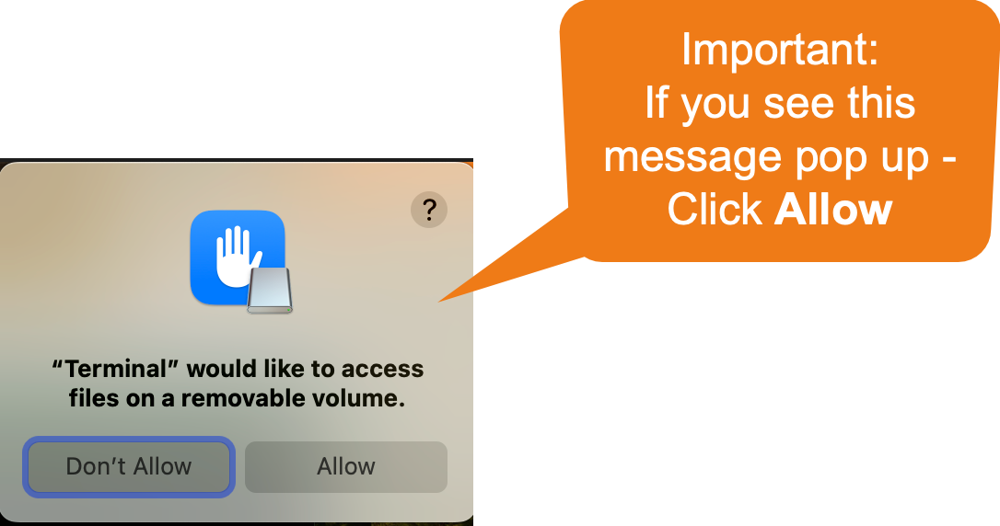

# 🛠️ Getting set up

Make sure you have a capable machine as desribed in [System requirements](../../overview/system-requirements.md) section.

## Run a Bitcoin Node in three easy steps

To simply the concept of running a Bitcoin Full node, you can break it down into three core steps:

1. Check and Format SSD if needed
2. Download the Bitcoin Core client and install it
3. Configure, initialize, and run the node

In the sections below we dive deeper into how each of these core steps can be completed.

For questions, join the [Discord community](https://discord.gg/ninjalerts), and give me a follow on X [@tahaabbasi](https://twitter.com/tahaabbasi)

Step1: Check and format SSD if needed

Make sure your SSD is formatted correctly. On Macs, it is recommended to use `APFS`, or `Mac OS Extended (Journaled)` vs the typical `ExFAT` format that some SSD's come with.&#x20;

## Steps to check and if needed update the SSD Format

1. Connect the SSD External Drive to your Mac
2. Open `Disk Utility` by searching in spotlight search
3.  Right click on your SSD and click Erase\

    <figure><figcaption></figcaption></figure>

    **Important:** Make sure you format the External SSD and not the internal Macintosh HD
4.  From the popup choose Format dropdown and select `APFS`, or if `APFS` is not available, then select `Mac OS Extended (Journaled)`\

    <figure><figcaption></figcaption></figure>
5.  Click Erase, once complete you can move on to the next step\
    \

    <figure><figcaption></figcaption></figure>

Step 2: Download the Bitcoin Core client and install it

## Identify processor type

Before you can download the bitcoin core client, you need to identify which type of processor your Mac has. Newer Macs typically run Apple's M series chips (M1, M2, M3 etc), where as older generation could be running Intel chips. Here is how to check your processor version:

1. Click the  apple logo on the top left
2. Click About This Mac
3. A window will pop up with information about your computer as shown below\
   \
   .png>)
4. Note down if you have any of the M series chips (M1, M2, M3, etc) or an Intel chip

## Download Bitcoin Core client for your chip type

1. Go to [https://bitcoin.org/en/download](https://bitcoin.org/en/download)
2.  For Intel chips download `macOS (x86_64)` version and for M series (M1, M2, M3, etc) chips download `macOS (arm64)` version as shown in the image below\

    <figure><figcaption></figcaption></figure>
3. Once the download is completed, you will see the .dmg file in your downloads folder
4.  Opening this file will show a pop up window with Bitcoin Core, drag this file into your applications folder\

    <figure><figcaption></figcaption></figure>
5.  Now you have installed the Bitcoin Core, before you run it, we'll go over config items in the next section :rocket:\

    <figure><figcaption></figcaption></figure>

Step 3: Configure, initialize and run the node

Now that you have installed Bitcoin Core it's time to run it. Before we run it and let it start syncing, we will take some steps to speed up synchronization. Follow these steps even if they seem repititve.&#x20;

1. Make sure your SSD is still connected
2. Go to you Applications folder and open the Bitcoin Core application
3.  You will see a pop-up as shown below, here select `Use a custom data directory`, then navigate to and select your External SSD drive as shown in the image below\
    \

    <figure><figcaption></figcaption></figure>
4. Once you click `OK` your node should start to sync. However, at this point we want to stop it briefly. So wait about a minute, then quit the Bitcoin Core application by pressing `CMD+Q`&#x20;
5.  After the Bitcoin Core application is closed, you can navigate to your External SSD and you will see a bunch of new files and folders (directories) in here. Note, you won't have the bitcoin.conf file yet (see next step)\

    <figure><figcaption></figcaption></figure>
6. As shown in the image above, the files and folders in the orange rectangle are the ones added by the Bitcoin Core software. The one specific file that you will be missing is the bitcoin.conf file. This file has configuration provided by [trevor.btc](https://twitter.com/TO). You can download the file from here:\
   \
   [https://drive.google.com/file/d/1OyElU2vXH1r4ruGc\_9ZAWCysN02yFLlz/view?usp=sharing](https://drive.google.com/file/d/1OyElU2vXH1r4ruGc\_9ZAWCysN02yFLlz/view?usp=sharing)\

7. Download the file and move it into the SSD drive as shown in the picture in step 5
8.  Run the Bitcoin Core application again, at this point you should see a window similar to the one shown below:\

    <figure><figcaption></figcaption></figure>
9. Initially you won't see a value for "Estimated time left until synced". It takes a few minutes, sometimes longer for this field to show a value. After some time, the application will show you how long it will take to sync. Keep your computer powered on during this period. If you need to step away, start a long youtube timer video such as this one:\
   \
   [https://www.youtube.com/watch?v=R2DY4cN0TFE](https://www.youtube.com/watch?v=R2DY4cN0TFE)
10. The video helps keep your machine in active state while the BItcoin node syncs. Once the node is synced, headover to [Pizza Ninja Discord](https://discord.gg/ninjalerts) to get the next steps and get setup for Runes\
    \

    <figure><figcaption></figcaption></figure>

