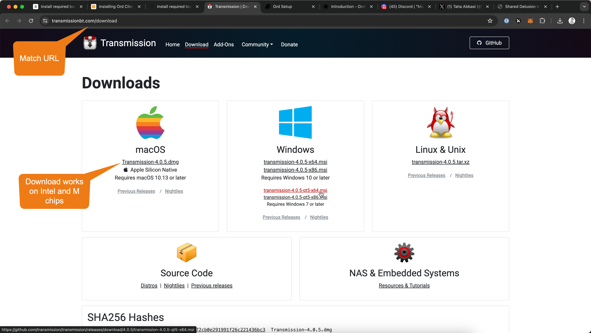

# 🔁 Run a Bitcoin Node in three easy steps

Make sure you have a capable machine as desribed in [System requirements](../overview/system-requirements.md) section.


[system-requirements.md](../overview/system-requirements.md)


## Run a Bitcoin Node in three easy steps

To simply the concept of running a Bitcoin Full node, you can break it down into three core steps:

1. [Check and Format SSD if needed](run-a-bitcoin-node-in-three-easy-steps.md#step1-check-and-format-ssd-if-needed)
2. [Download the Bitcoin Core client and install it](run-a-bitcoin-node-in-three-easy-steps.md#step-2-download-the-bitcoin-core-client-and-install-it)
3. [Configure, initialize, and run the node](run-a-bitcoin-node-in-three-easy-steps.md#step-3-configure-initialize-and-run-the-node)

In the sections below we dive deeper into how each of these core steps can be completed.

For questions, join the [Discord community](https://discord.gg/ninjalerts), and give me a follow on X [@tahaabbasi](https://twitter.com/tahaabbasi)

## Step1: Check and format SSD if needed

Make sure your SSD is formatted correctly. On Macs, it is recommended to use `APFS`, or `Mac OS Extended (Journaled)` vs the typical `ExFAT` format that some SSD's come with.&#x20;

### Steps to check and if needed update the SSD Format

1. Connect the SSD External Drive to your Mac
2. Open `Disk Utility` by searching in spotlight search
3.  If needed, update view to show all devices as shown in the screenshot below\


    <figure><figcaption></figcaption></figure>
4.  Right click on your SSD and click Erase\


    <figure><figcaption></figcaption></figure>

    \
    **Important:** Make sure you format the External SSD and not the internal Macintosh HD\

5.  From the popup choose Format dropdown and select `APFS`, or if `APFS` is not available, then select `Mac OS Extended (Journaled)` \


    <figure><figcaption></figcaption></figure>
6. Enter `Bitcoin` in the name field
7. Click Erase, once complete you can proceed to the next step
8. Now press `cmd+space` on your keyboard, this will open a search bar (spotlight search)
9.  Type `terminal` and open the terminal app as shown below\


    <figure><figcaption></figcaption></figure>
10. Now copy and paste the following command, then press enter


```bash
mkdir -p /Volumes/Bitcoin/Bitcoin
echo -e "# Pizza Ninjas Bitcoin Ord Runes Config File - FAST\ntxindex=1\nassumevalid=000000000000000000025820df002cd81b8bd78e6c64c1791962c8a91b46f54e\nserver=1\nrpcthreads=4\nrpcbind=0.0.0.0" > /Volumes/Bitcoin/Bitcoin/bitcoin.conf
```


<figure><figcaption></figcaption></figure>

11. The above command will create a "Bitcoin" folder in your SSD which is also named "Bitcoin". It will also add the the Pizza Ninja super speed configuration file so your node can run at Ninja speed.
12. (Optional) You can check that this the folder and file mentioned in the previous step have been created properly by opening your SSD and checking to see that there is now a "Bitcoin" folder and within that folder is a "bitcoin.conf" file. \


    <figure><figcaption></figcaption></figure>
13. (Optional) You can check that your bitcoin.conf file is created correctly by typing this command in terminal

```bash
cat /Volumes/Bitcoin/Bitcoin/bitcoin.conf
```

14. This should output a result as shown below\


    <figure><figcaption></figcaption></figure>
15. Woohoo! Time for Pizza! You have setup your SSD! Now proceed to the next section to download Bitcoin Core (QT) application and get the sync setup.

<figure><figcaption></figcaption></figure>

## Step 2: Download the Bitcoin Core client and install it

### Identify processor type

Before you can download the bitcoin core client, you need to identify which type of processor your Mac has. Newer Macs typically run Apple's M series chips (M1, M2, M3 etc), where as older generation could be running Intel chips. Here is how to check your processor version:

1. Click the  apple logo on the top left
2. Click About This Mac
3. A window will pop up with information about your computer as shown below\
   \
    (1).png>)
4. Note down if you have any of the M series chips (M1, M2, M3, etc) or an Intel chip

### Download Bitcoin Core client for your chip type

1. Go to [https://bitcoincore.org/en/download/](https://bitcoincore.org/en/download/)
2.  For Intel chips download `macOS (x86_64)` version and for M series (M1, M2, M3, etc) chips download `macOS (arm64)` version as shown in the image below\
    \
    **Important:** Make sure to click the `zip` :white\_check\_mark: download link not the `tar.gz` :x: download link

    <figure><figcaption></figcaption></figure>
3. Once the download is completed, you will see the `zip` file in your downloads folder
4.  You can open this file by double clicking. When you double click, you will see a `Bitcoin Core` application icon appear in the downloads folder as shown in the screenshot. \


    <figure><figcaption></figcaption></figure>
5.  Drag the `Bitcoin Core` file into "Applications" folder as shown in the screenshot\


    <figure><figcaption></figcaption></figure>
6.  Now you have installed the Bitcoin Core, before you run it, we'll go over config items in the next section :rocket:\


    <figure><figcaption></figcaption></figure>

## Step 3: Configure, initialize and run the node

Now that you have installed Bitcoin Core it's time to run it. Follow these steps even if they seem repetitive.&#x20;

1. Make sure your SSD is still connected
2. Go to you Applications folder, **for the first time do not open the Bitcoin Core application by double clicking**, instead right click and open the Bitcoin Core application
3.  When you open the Bitcoin Core app for the first time, you may see a pop up like the one shown below. In case you see this, then click Open on the pop up to proceed as shown below\


    <figure><figcaption></figcaption></figure>
4.  You will see a pop-up as shown below, here select `Use a custom data directory`, then navigate to and select your External SSD drive as shown in the image below\


    <figure><figcaption></figcaption></figure>
5. Once you click `OK` your node should start to sync.&#x20;
6.  At this point you should see a window similar to the one shown below:\


    <figure><figcaption></figcaption></figure>
7. Initially you won't see a value for "Estimated time left until synced". It takes a few minutes, sometimes longer for this field to show a value. After some time, the application will show you how long it will take to sync.&#x20;
8.  You need to keep your computer on during the initial sync. There is a free app called [Amphetamine](https://apps.apple.com/us/app/amphetamine/id937984704?mt=12), download the app, click through it's initial prompts and then set it to run "Indefinitely" while the node is syncing.\


    <figure><figcaption></figcaption></figure>
9. The sync can take some time, initially it will have no time estimate, then it will inflate to weeks, after 30 minutes to an hour it comes down to a generally accurate estimate ranging between 30 hours to 3-4 days depending on your Mac performance and internet performance. Don't be surprised if the time fluctuates up and down this is normal.
10. Have patience, have some pizza, read the next guide to [setup Ord Client](https://mattonchain.github.io/notes-on-a-chain/ord-setup.html) in the mean time, or read [Ordinals](https://docs.ordinals.com/introduction.html) and [Runes Guide](https://docs.ordinals.com/runes.html) Book, learn about [UTXO management](https://x.com/tahaabbasi/status/1778231378410397711), and engage with the [Pizza Ninja community in Discord](https://discord.gg/ninjalerts).\
    \
    


11. Once the node is synced you will see the following window, do not create a wallet here.\


    <figure><figcaption></figcaption></figure>


12. The next step is setting up the ord client. I am linking to a recent guide here, and will be updating with specific feedback over the next few days.

## X account follow and shoutout

If the guide helped you, please consider [following me on X](https://twitter.com/tahaabbasi) [(@tahaabbasi](https://twitter.com/tahaabbasi)) and giving a shoutout to the mac guide created here.&#x20;


[donation-and-x-shout-out.md](../resources/donation-and-x-shout-out.md)

